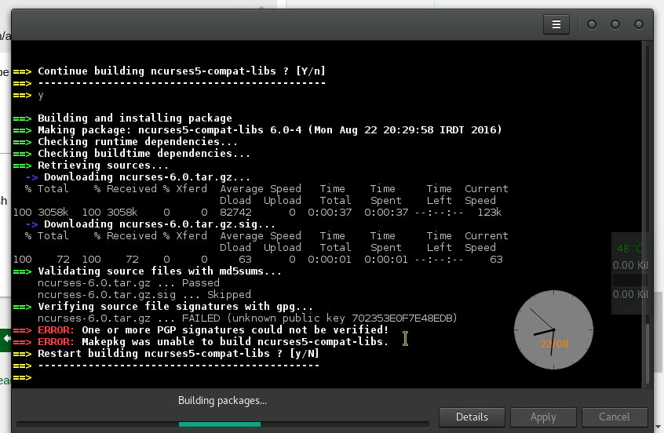
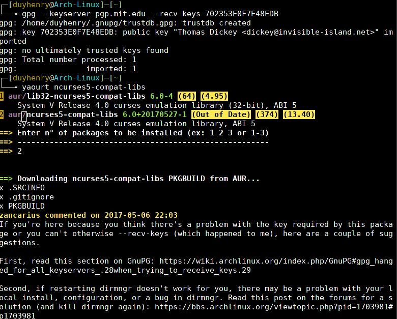
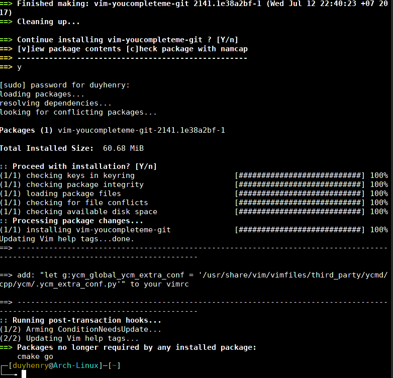

# fix--->ncurses5-compat-libs
A few error [Link](https://forum.manjaro.org/t/solved-cant-install-android-sdk-platform-tools-from-aur/6187/6).


## Sulotions:
For axemple : Swift 2 on Linux


[Swift 2 on Linux ](http://juanroa.me/2016/swift-on-linux/) 


```
yaourt ncurses5-compat-libs

```
Therefore



## Fix: Install the GPG signature for ncurses package
```aidl

gpg --keyserver pgp.mit.edu --recv-keys C52048C0C0748FEE227D47A2702353E0F7E48EDB
```




###Got it!



