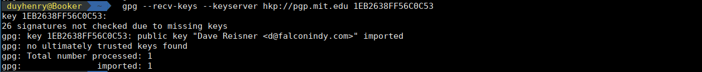

# Issues:
...
... FAILED (unknown public key 1EB2638FF56C0C53)
==> ERROR: One or more PGP signatures could not be verified!
==> ERROR: Makepkg was unable to build cower.

Screenshot(image/cower.png)

Issues on Forums Arch (https://bbs.archlinux.org/viewtopic.php?id=191954)

## Sulotions:
If you are having problems installing this package due to signature verification, please run the below before running makepkg:

```
$ gpg --recv-keys --keyserver hkp://pgp.mit.edu 1EB2638FF56C0C53
```

Install more package:` ncurses5-compat-libs | cower`


```
$ yaourt ncurses5-compat-libs
$ yaourt cower
```

After verification PGP:




